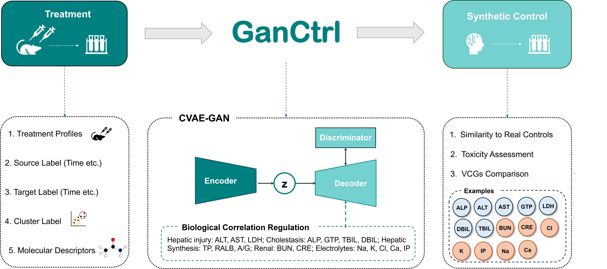

<h1 align="center"><i>GanCtrl</i></h1>

<p align="center">
  <strong>Study-aligned synthetic controls from time-matched treatment data for preclinical toxicology using generative AI</strong>
</p>

<p align="center">

[](https://doi.org/10.1093/toxsci/kfag099)
[](https://doi.org/10.5281/zenodo.17883691)
[](LICENSE)


</p>

<p align="center">
  <a href="#quick-start"><strong>Quick Start</strong></a> •
  <a href="#workflow--scripts"><strong>Workflow & Scripts</strong></a> •
  <a href="#methods"><strong>Methods</strong></a> •
  <a href="#data--outputs"><strong>Data & Outputs</strong></a> •
  <a href="#citation"><strong>Citation</strong></a>
</p>

---

<p align="center">
  
</p>

<p align="center">
  <em>GanCtrl generates time-matched synthetic control profiles from treatment-derived clinical pathology data.</em>
</p>

---

## Overview

***GanCtrl*** (**GAN-based synthetic control**) is a **conditional VAE-GAN** framework that translates high-dose treatment-derived clinical-pathology profiles into their **time-matched control equivalents**.

Developed using the **Open TG-GATEs** rat *in vivo* repeat-dose dataset, GanCtrl models **38 clinical pathology measurements** using a context-conditioned encoder, an attention-aware biologically informed decoder, and an adversarial discriminator.

The framework is designed to generate physiologically coherent synthetic controls while preserving biologically relevant relationships required for downstream toxicological evaluation.

---

## GanCtrl at a Glance

| | |
|---|---|
| **Model** | Conditional VAE-GAN |
| **Input** | High-dose treatment clinical-pathology profiles |
| **Output** | Time-matched synthetic control profiles |
| **Dataset** | Open TG-GATEs rat *in vivo* repeat-dose studies |
| **Measurements** | 38 clinical pathology endpoints |
| **Conditioning** | Body weight, timepoint, replicate identity, study-specific clusters |
| **Evaluation** | Cosine similarity, RMSE, biological co-elevation, toxicity concordance |
| **Benchmarks** | Inter-laboratory, intra-laboratory, replicate control, VCG, VCG-LR |

---

# Quick Start

### 1. Clone GanCtrl

```bash
git clone https://github.com/CHANDMX20/GanCtrl.git
cd GanCtrl
```

### 2. Obtain the input data

The preprocessed training and held-out test datasets used by GanCtrl are available through Zenodo:

### **[Download GanCtrl Input Data](https://doi.org/10.5281/zenodo.17883691)**

Configure the required input and output paths in the relevant scripts for your local environment.

### 3. Choose a reproducibility path

| Goal                                   | Start from                                |
| -------------------------------------- | ----------------------------------------- |
| **Train GanCtrl from the beginning**   | Preprocessed Zenodo inputs                |
| **Generate synthetic controls**        | Trained GanCtrl checkpoints               |
| **Reproduce downstream analyses only** | Generated predictions included in `data/` |

All scripts required for these workflows are listed below.

---

# Workflow & Scripts

```text
Open TG-GATEs
      │
      ▼
Preprocessed Inputs
      │
      ▼
GanCtrl Training
      │
      ▼
Synthetic Controls
      │
      ├───────────────┬─────────────────┐
      ▼               ▼                 ▼
 Agreement        Biological         Toxicity
 Evaluation       Co-elevation      Concordance
      │
      ▼
 VCG / VCG-LR
 Benchmark
```

> Scripts can be executed with `python <script-path>` after configuring the required local input/output paths.

| Stage  | Analysis                          | Script(s)                                                                                                                                     |
| ------ | --------------------------------- | --------------------------------------------------------------------------------------------------------------------------------------------- |
| **1**  | GanCtrl training                  | [`training/ganctrl_training.py`](./training/ganctrl_training.py)                                                                              |
| **2**  | Synthetic-control generation      | [`training/train_test_samples.py`](./training/train_test_samples.py)                                                                          |
| **3A** | Inter-laboratory agreement        | [`interlab_cosine.py`](./baseline/interlab_cosine.py) · [`interlab_rmse.py`](./baseline/interlab_rmse.py)                                     |
| **3B** | Intra-laboratory agreement        | [`intralab_cosine.py`](./baseline/intralab_cosine.py) · [`intralab_rmse.py`](./baseline/intralab_rmse.py)                                     |
| **3C** | Replicate-control agreement       | [`replicate_control_cosine.py`](./baseline/replicate_control_cosine.py) · [`replicate_control_rmse.py`](./baseline/replicate_control_rmse.py) |
| **3D** | GanCtrl vs real-control agreement | [`cosine.py`](./evaluation/cosine.py) · [`rmse.py`](./evaluation/rmse.py)                                                                     |
| **4**  | Biological co-elevation           | [`co-elevation.py`](./evaluation/co-elevation.py)                                                                                             |
| **5A** | Concordance threshold calibration | [`train_concordance.py`](./evaluation/train_concordance.py)                                                                                   |
| **5B** | Held-out toxicity concordance     | [`test_concordance.py`](./evaluation/test_concordance.py)                                                                                     |
| **6A** | VCG benchmark                     | [`vcg_baseline.py`](./vcg/vcg_baseline.py)                                                                                                    |
| **6B** | Laboratory-relaxed VCG            | [`vcg-lr_baseline.py`](./vcg/vcg-lr_baseline.py)                                                                                              |

---

# Methods

Expand the sections below for methodological details.

<details>
<summary><strong>🧠 GanCtrl architecture and training</strong></summary>

<br>

GanCtrl is a one-sided **conditional VAE-GAN** trained to map high-dose treatment clinical-pathology profiles to their time-matched control equivalents.

### Conditioning variables

* **Body weight**
* **Timepoint**
* **Replicate identity**
* **Study-specific clusters**

### Training objectives

* **Variance-aware Gaussian negative log likelihood**
* **Adversarial loss**
* **TBIL range-constraint loss**
* **Biological correlation-preservation loss**
* **Batch-level mean matching**

These components are designed to preserve organ-level biological relationships and realistic variability while generating physiologically coherent synthetic-control profiles.

The implementation uses fixed random seeds and deterministic TensorFlow operations to support reproducibility.

</details>

---

<details>
<summary><strong>📏 Synthetic vs real-control agreement</strong></summary>

<br>

Generated synthetic controls are compared with corresponding real controls using:

* **Cosine similarity**
* **Root mean squared error (RMSE)**

GanCtrl is interpreted relative to three real-control benchmarks:

### Inter-laboratory

Cross-study real-control agreement using the same vehicle across different laboratories.

### Intra-laboratory

Within-study real-control agreement using the same vehicle and laboratory.

### Replicate control

Agreement between biological replicates within a treatment, providing a benchmark for real biological variability.

### GanCtrl

Agreement between each generated synthetic-control profile and its corresponding real-control profile.

</details>

---

<details>
<summary><strong>🧬 Biological co-elevation analysis</strong></summary>

<br>

GanCtrl is evaluated for its ability to preserve literature-anchored **hepatotoxicity** and **nephrotoxicity** biological conclusions.

Treatment-associated measurement elevations are identified using:

* One-sided Welch t-tests
* Benjamini-Hochberg false discovery rate correction

### Coordinated liver responses

* **ALT–AST**
* **ALP–TBIL**
* **ALP–GGT/GTP**
* **ALT–AST–LDH**

### Coordinated kidney response

* **BUN–CRE**

Agreement between real- and synthetic-control conclusions is evaluated using:

| Metric                | Definition                                                                              |
| --------------------- | --------------------------------------------------------------------------------------- |
| **Recall**            | Fraction of real-control co-elevations also detected using synthetic controls           |
| **Specificity**       | Fraction of real-control non-elevations remaining non-elevated using synthetic controls |
| **Balanced Accuracy** | Mean of recall and specificity                                                          |

</details>

---

<details>
<summary><strong>🧪 Toxicity concordance</strong></summary>

<br>

The concordance analysis evaluates whether synthetic controls reproduce the **sample-level abnormal/normal classifications** obtained using real concurrent controls.

For each compound-time group and clinical pathology measurement:

  $z = \dfrac{x_{\text{treatment}} - \mu_{\text{control}}}{\sigma_{\text{control}}}$

The decision threshold is:

1. Calibrated using the **training set**
2. Fixed before evaluation
3. Applied to the independent **held-out test set**

Synthetic-control classifications are compared with real-control classifications using:

* True positives (**TP**)
* True negatives (**TN**)
* False positives (**FP**)
* False negatives (**FN**)

  $\text{Concordance Accuracy} = \dfrac{TP + TN}{TP + TN + FP + FN}$

> **Primary question:** If the concurrent control arm is replaced with GanCtrl-generated synthetic controls, are the same toxicological conclusions reached?

</details>

---

<details>
<summary><strong>📚 Historical-control VCG benchmark</strong></summary>

<br>

GanCtrl is benchmarked against virtual control groups (**VCGs**) constructed from historical control data.

Historical controls are drawn from training-set concurrent controls. Controls originating from the same compound as the test group are excluded to prevent information leakage.

### VCG

Matched on:

* Sacrifice time
* Vehicle
* Laboratory

### VCG-LR

Matched on:

* Sacrifice time
* Vehicle

while allowing controls from different laboratories.

For each test group:

* The VCG contains the same number of animals as the corresponding real concurrent control group.
* Sampling is repeated **100 times** using independent draws from the eligible historical-control pool.

</details>

---

# Data & Outputs

All GanCtrl data-related information is consolidated in this section.

## Raw Open TG-GATEs Data

GanCtrl was developed using rat *in vivo* repeat-dose clinical pathology data from **Open TG-GATEs**.

The raw Open TG-GATEs data are **not redistributed through this repository**.

**[Open TG-GATEs Download Page](https://dbarchive.biosciencedbc.jp/en/open-tggates/download.html)**

---

## Preprocessed GanCtrl Inputs

The exact preprocessed training and held-out test inputs used by GanCtrl are distributed through Zenodo because of their size.

### **[Download Preprocessed GanCtrl Inputs](https://doi.org/10.5281/zenodo.17883691)**

The deposit contains treatment/control inputs, metadata, and molecular descriptor features required by the model.

<details>
<summary><strong>📂 Show principal input files</strong></summary>

<br>

```text
repeat_train_treatment_2d.csv
repeat_train_control_2d.csv
repeat_test_treatment_2d.csv
repeat_test_control_2d.csv
```

</details>

---

## Generated Synthetic Controls

Generated decoded synthetic-control predictions are included in [`data/`](./data), allowing downstream analyses to be reproduced **without retraining GanCtrl**.

<details>
<summary><strong>📊 Show prediction files</strong></summary>

<br>

| File                                                                                    | Description                                                    |
| --------------------------------------------------------------------------------------- | -------------------------------------------------------------- |
| [`generated_liver_train.csv`](data/generated_liver_train.csv)                           | Liver synthetic controls — training set                        |
| [`generated_liver_test.csv`](data/generated_liver_test.csv)                             | Liver synthetic controls — held-out test set                   |
| [`generated_kidney_train.csv`](data/generated_kidney_train.csv)                         | Kidney synthetic controls — training set                       |
| [`generated_kidney_test.csv`](data/generated_kidney_test.csv)                           | Kidney synthetic controls — held-out test set                  |
| [`generated_predictions_merged_train.csv`](data/generated_predictions_merged_train.csv) | Combined liver + kidney predictions for training-set analyses  |
| [`generated_predictions_merged_test.csv`](data/generated_predictions_merged_test.csv)   | Combined liver + kidney predictions for held-out test analyses |

</details>

---

<details>
<summary><strong>💾 Show model and inference outputs</strong></summary>

<br>

Depending on the training and inference configuration:

```text
g_model1_*.h5
d_model1_*.h5
composite_model1_*.h5
predictions_encoded/
predictions_decoded/
samples/generated_samples_s{K}_*.csv
```

| Output                  | Description                                 |
| ----------------------- | ------------------------------------------- |
| `g_model1_*.h5`         | Generator checkpoints                       |
| `d_model1_*.h5`         | Discriminator checkpoints                   |
| `composite_model1_*.h5` | Composite-model checkpoints                 |
| `predictions_encoded/`  | Encoded-space predictions, if enabled       |
| `predictions_decoded/`  | Fully decoded synthetic-control predictions |

</details>

---

<details>
<summary><strong>🔬 Show clinical pathology variables</strong></summary>

<br>

GanCtrl evaluates **38 clinical pathology measurements** spanning clinical chemistry and hematology.

### Key metadata

```text
COMPOUND_NAME
DOSE_LEVEL
SACRIFICE_PERIOD
INDIVIDUAL_ID
```

### Liver-associated measurements

| Abbreviation | Measurement                |
| ------------ | -------------------------- |
| ALP          | Alkaline phosphatase       |
| ALT          | Alanine aminotransferase   |
| AST          | Aspartate aminotransferase |
| GTP/GGT      | Gamma-glutamyl transferase |
| LDH          | Lactate dehydrogenase      |
| TBIL         | Total bilirubin            |
| DBIL         | Direct bilirubin           |

### Kidney-associated measurements

| Abbreviation | Measurement          |
| ------------ | -------------------- |
| BUN          | Blood urea nitrogen  |
| CRE          | Creatinine           |
| Ca           | Calcium              |
| Cl           | Chloride             |
| Na           | Sodium               |
| IP           | Inorganic phosphorus |
| K            | Potassium            |

</details>

---

# Repository Organization

<details>
<summary><strong>📁 Show repository structure</strong></summary>

<br>

```text
GanCtrl/
│
├── training/      # Model training and synthetic-control generation
├── evaluation/    # Agreement and toxicological analyses
├── baseline/      # Real-control agreement benchmarks
├── vcg/           # Historical-control benchmarks
├── data/          # Generated synthetic-control predictions
├── plots/         # Study-design and supporting figures
├── README.md
└── LICENSE
```

Individual scripts are listed in the [Workflow & Scripts](#workflow--scripts) section.

</details>

---

# Environment

| Software           | Version |
| ------------------ | ------: |
| **Python**         |  3.11.7 |
| **TensorFlow-GPU** |   2.4.1 |
| **R**              |   4.4.1 |
| **Bioconductor**   |    3.19 |

Additional Python and R dependencies are imported within the corresponding analysis scripts.

---

# Reproducibility

GanCtrl supports two reproducibility paths.

<table>
<tr>
<td width="50%" valign="top">

### Full reproduction

```text
Zenodo Inputs
      ↓
Train GanCtrl
      ↓
Generate Synthetic Controls
      ↓
Run Evaluation Pipeline
```

</td>
<td width="50%" valign="top">

### Downstream reproduction

```text
Provided Predictions
      ↓
Agreement Analysis
      ↓
Biological Evaluation
      ↓
Toxicity Evaluation
```

</td>
</tr>
</table>

The repository uses fixed random seeds, deterministic TensorFlow operations, explicit training/test splits, publicly available input data, and provided synthetic-control predictions to support reproducibility.

---

# Research Resources

| Resource                 | Access                                                            |
| ------------------------ | ----------------------------------------------------------------- |
| 📄 **Published paper**   | [Toxicological Sciences](https://doi.org/10.1093/toxsci/kfag099)  |
| 📦 **Preprocessed data** | [Zenodo](https://doi.org/10.5281/zenodo.17883691)                 |
| 💻 **Source code**       | [GanCtrl GitHub repository](https://github.com/CHANDMX20/GanCtrl) |
| 📜 **License**           | [MIT License](LICENSE)                                            |

---

# Citation

If you use **GanCtrl** in your research, please cite the associated paper and dataset.

### GanCtrl Paper

**GanCtrl: A Generative AI Approach to Derive Study-Aligned Synthetic Controls for Reducing Concurrent Control Animal Use.**
*Toxicological Sciences*.
https://doi.org/10.1093/toxsci/kfag099

### GanCtrl Dataset

**Chandra, M.**
*GanCtrl: Synthetic Control Predictions for Liver and Kidney Clinical-Pathology Profiles (Open TG-GATEs).*
Zenodo.
https://doi.org/10.5281/zenodo.17883691

---

# License

This project is licensed under the **MIT License**.

See the [`LICENSE`](LICENSE) file for details.

---

<p align="center">
  <strong>GanCtrl</strong><br>
  <em>Generative AI for study-aligned synthetic controls in preclinical toxicology</em>
</p>
